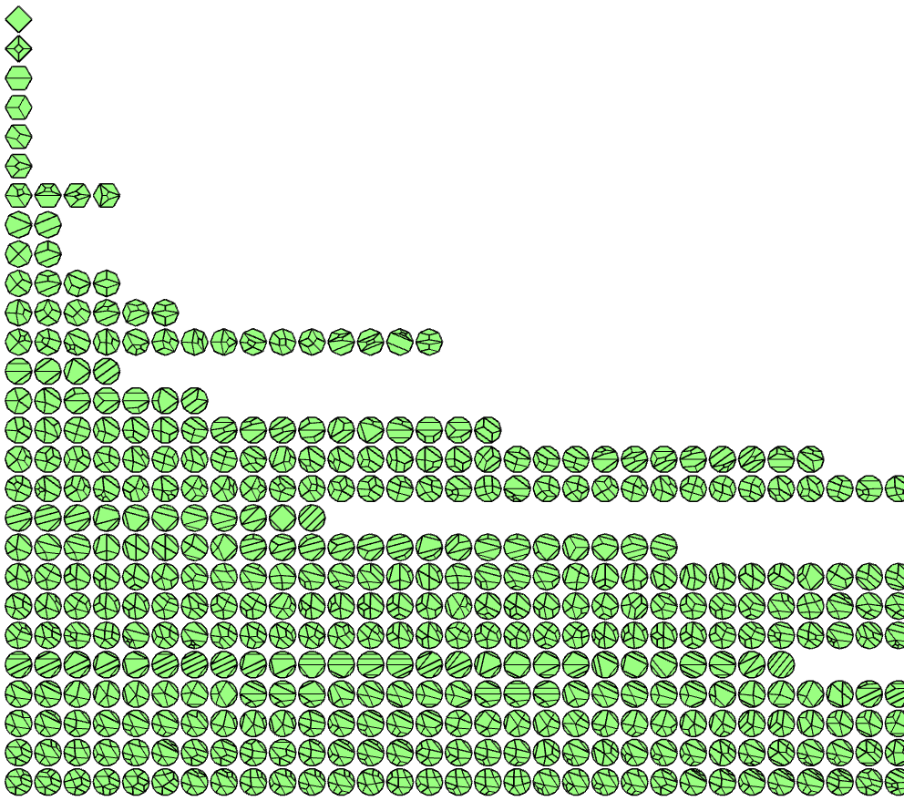

# Disk quadrangulations

Enumerate topological disk quadrangulations by successively applying edge flips. 
This is a 2D version of the Algorithm 5 from the paper "Finding Hexahedrizations for Small Quadrangulations of the Sphere
(Kilian Verhetsel, Jeanne Pellerin, Jean-François Remacle, SIGGRAPH 2019)".

Quadrilateral mesh equivalences are identified by computing canonical labelling of the edge graphs with the library Nauty.

You can use the executable ./bin/enumerate to generate them (see -h for the options).

A quadrangulation list is available in the folder results/, with
quadrangulations with up to 14 boundary vertices, 4 interior vertices, maximal
interior quad valence to 5 and maximal boundary quad valence to 3.  There is
also a .pos file to visualize the quadrangulations in gmsh.

